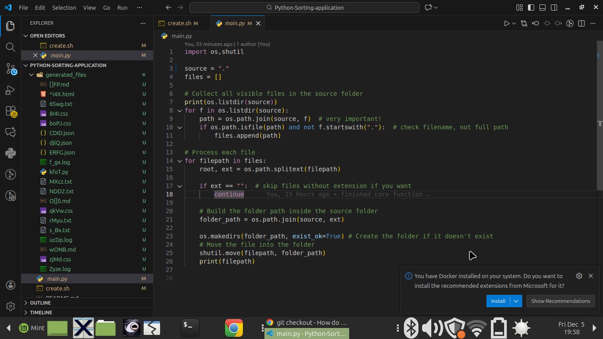
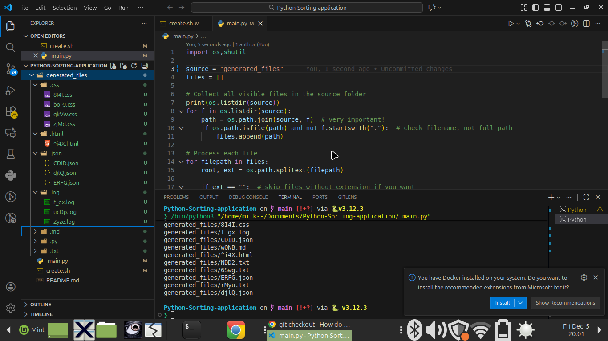

# Python-Sorting-script
It's a Python script that takes in an argument, then sorts the folder based on their file extensions and creates subfolders respectively.
# Use
This is optional!
create.sh is a script that creates a bunch of files so you can test the sorting.
```bash
bash create.sh folder_name
```
Run the script + name of the folder you want to sort
```bash
python3 sort.py folder_name
```
# It goes from this


# To this 

